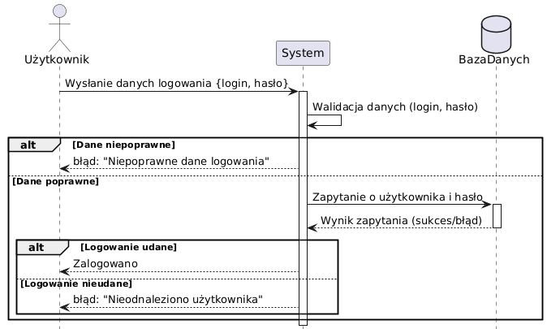

Programowanie zespołowe laboratorium _**3**_ grupa _**1**_

# Dokumentacja projetu: **System do zarządzania zadaniami w hotelu**

## Zespoł projetowy:
- Krzysztof Motas (Lider)
- Konrad Pluta
- Patryk Jarosiewicz
- Jakub Orczyk

## Opis aplikacji

## Cel projektu 
Aplikacja Hotel Task Manager to narzędzie do zarządzania zadaniami w hotelu. System umożliwia delegowanie zadań, śledzenie ich postępu. Dzięki intuicyjnemu interfejsowi, pracownicy mogą na bieżąco otrzymywać i aktualizować informacje o swoich obowiązkach, co poprawia organizację pracy w hotelu.

## Zakres projektu

## Wymagania stawiane aplikacji

System powinien składać się z kilku niezależnych modułów, które pozwalają na elastyczne zarządzanie zadaniami i użytkownikami:

- **Moduł administracji użytkownikami (role)** – umożliwia nadawanie uprawnień i zarządzanie kontami pracowników.
- **Moduł raportów** – pozwala na analizę danych, generowanie statystyk dotyczących realizacji zadań oraz pracy hotelu.
- **Moduł konfiguracji** – daje możliwość dostosowania ustawień konta, m.in. zmiany hasła, zarządzania automatycznymi powiadomieniami itd.
- **Moduł zgłaszania usterek i zadań** – integracja z recepcją i personelem, pozwalająca na szybkie przesyłanie zgłoszeń i monitorowanie ich realizacji.
- **Moduł integracji z systemem rezerwacji hotelowej** – automatyczne przypisywanie zadań, np. sprzątania po wymeldowaniu gościa.

## Integracja z bazą danych

- System powinien być oparty na bazie danych, która pozwala na **szybki dostęp do informacji** o użytkownikach, zadaniach, zgłoszeniach i raportach.
- Powinien umożliwiać **przechowywanie historii zmian** w zadaniach i zgłoszeniach.

## Bezpieczeństwo i dostęp użytkowników

- System powinien posiadać **mechanizmy autoryzacji i uwierzytelniania użytkowników** (logowanie, resetowanie hasła).
- Dostęp do poszczególnych funkcji powinien być **ograniczony na podstawie ról**.
- Hasła użytkowników powinny być **szyfrowane**.

## Panele / zakładki systemu, które będą oferowały potrzebne funkcjonalności  

### **Panel pracownika**  
Moduł dostępny dla każdego użytkownika systemu, obejmujący:  
- **Logowanie i resetowanie hasła** – możliwość logowania i odzyskiwania dostępu do konta.  
- **Zarządzanie kontem** – edycja danych użytkownika oraz ustawień konta.  
- **Odbieranie i realizacja zadań** – możliwość przeglądania i aktualizacji statusu przydzielonych obowiązków.  

### **Panel recepcjonisty**  
Interfejs wspomagający pracę recepcji hotelowej, zawierający:  
- **Zarządzanie rezerwacjami** – tworzenie, edytowanie i usuwanie rezerwacji pokoi.  
- **Obsługa zgłoszeń** – przyjmowanie i zarządzanie zgłoszeniami gości dotyczących usterek oraz innych spraw.
- **Podgląd statusu zgłoszeń** – monitorowanie realizacji zgłoszeń przez personel.  

### **Panel konserwatora**  
Moduł przeznaczony dla działu technicznego, umożliwiający:  
- **Obsługę zgłoszeń usterek** – przeglądanie i aktualizowanie zgłoszeń napraw.  

### **Panel pokojówki**  
Interfejs dla personelu sprzątającego, obejmujący:  
- **Monitorowanie i zarządzanie zleceniami dotyczącymi stanu pokoi**  
- **Tworzenie zgłoszeń usterek** – raportowanie usterek i problemów w pokojach.  

### **Panel menadżera hotelu**  
Moduł umożliwiający:  
- **Zarządzanie pracownikami** – dodawanie, edytowanie i usuwanie kont użytkowników, a także nadawanie uprawnień.  
- **Zarządzanie pokojami** – dodawanie, modyfikacja i usuwanie pokoi.  
- **Zarządzanie raportami** – generowanie i przeglądanie raportów dotyczących działalności hotelu.  
- **Podgląd faktur** – przeglądanie wystawionych dokumentów księgowych. 

## Typy wymaganych dokumentów w projekcie oraz dostęp do nich 
- **Raporty** - system powinien umożliwiać generowanie raportów na podstawie danych dotyczących realizacji zadań, historii zgłoszeń. Raporty powinny obejmować **różne zakresy czasowe** (dziennie, tygodniowo, miesięcznie). Musi być możliwe także **eksportowanie danych do formatów CSV/PDF**.
- **Faktury VAT** – system powinien umożliwiać także wystawianie faktur VAT dla gości hotelu w formacie PDF.

## Przepływ informacji w środowisku systemu
Przepływ informacji w środowisku systemu jest scentralizowany i oparty na bazie danych, co oznacza, że wszystkie operacje są wykonywane przez centralny serwer, który zarządza dostępem do danych. Klient wysyła żądania do backendu poprzez REST API, np. w celu pobrania, zapisania lub aktualizacji informacji. Backend przetwarza żądania, wykonuje operacje na bazie danych i zwraca odpowiedź w formacie JSON. Dzięki temu pracownicy hotelu mają na bieżąco dostęp do aktualnych informacji o zadaniach, ich statusie i priorytetach, niezależnie od stanowiska, urządzenia czy lokalizacji w obiekcie.

## Użytkownicy aplikacji i ich uprawnienia

### Pracownik
*Rola ogólna, po której dziedziczą wszystkie inne role w systemie. Każdy użytkownik systemu jest pracownikiem i posiada podstawowe uprawnienia. Nie jest to jawna rola, lecz bazowa, zapewniająca minimalne funkcjonalności dla wszystkich użytkowników aplikacji.*
- Logowanie oraz resetowanie hasła
- Zarządzanie własnym kontem użytkownika
- Odbieranie i realizacja zadań

### Recepcjonista
- Tworzenie i zarządzanie rezerwacjami pokoi
- Zarządzanie zgłoszeniami gości hotelowych (tworzenie, modyfikowanie, usuwanie)

### Konserwator
- Monitorowanie i aktualizacja zgłoszeń usterek

### Pokojówka
- Monitorowanie i aktualizacja zleceń dotyczących stanu pokoi

### Manager hotelu
- Zarządzanie pracownikami (tworzenie, modyfikowanie i usuwanie kont pracowników)
- Przeglądanie statystyk dotyczących pracowników
- Zarządzanie pokojami (tworzenie, modyfikowanie, usuwanie pokoi)
- Zarządzanie raportami (tworzenie, generowanie, przeglądanie)
- Przeglądanie wystawionych faktur

## Interesariusze 
Interesariuszami aplikacji Hotel Task Manager są właściciele mniejszych hoteli, którzy chcą poprawić organizację pracy w swoim biznesie.

## Diagramy UML
- ###### [Diagram przypadków użycia]

- ###### [Diagramy aktywności]
#### Logowanie

#### Tworzenie zamówień

#### Zarządzanie zadaniami

#### Resetowanie hasła

#### Zgłaszanie poprawek zadań

#### Zarządzanie zgłoszeniami

#### Zarządzanie pracownikami

- ###### [Diagramy sekwencji]
#### Logowanie

### Dodawanie pracownika

### Dodawanie uwag do zadania

### Edytowanie pracownika

### Usuwanie zgłoszenia

### Usuwanie pracownika

### Przeglądanie statystyk zespołu

- ###### [Diagram klas]
  Wstawić rys. diagramu UML

## Baza danych
###### Diagram ERD

###### Skrypt do utworzenia struktury bazy danych

###### Opis bazy danych

## Wykorzystane technologie 
- Język Java 17
  - JavaFX
  - ...
- Baza danych MySQL
- Inne z opisem

## Pliki instalacyjne wraz z opisem instalacji i konfiguracji wraz pierwszego uruchomienia
