Programowanie zespołowe laboratorium _**3**_ grupa _**1**_

# Dokumentacja projetu: **System do zarządzania zadaniami w hotelu**

## Zespoł projetowy:
- Krzysztof Motas (Lider)
- Konrad Pluta
- Patryk Jarosiewicz
- Jakub Orczyk

## Opis aplikacji

## Cel projektu 
Aplikacja Hotel Task Manager to narzędzie do zarządzania zadaniami w hotelu. System umożliwia delegowanie zadań, śledzenie ich postępu. Dzięki intuicyjnemu interfejsowi, pracownicy mogą na bieżąco otrzymywać i aktualizować informacje o swoich obowiązkach, co poprawia organizację pracy w hotelu.

## Zakres projektu

## Wymagania stawiane aplikacji

System powinien składać się z kilku niezależnych modułów, które pozwalają na elastyczne zarządzanie zadaniami i użytkownikami:

- **Moduł administracji użytkownikami (role)** – umożliwia nadawanie uprawnień i zarządzanie kontami pracowników.
- **Moduł raportów** – pozwala na analizę danych, generowanie statystyk dotyczących realizacji zadań oraz pracy hotelu.
- **Moduł konfiguracji** – daje możliwość dostosowania ustawień konta, m.in. zmiany hasła, zarządzania automatycznymi powiadomieniami itd.
- **Moduł zgłaszania usterek i zadań** – integracja z recepcją i personelem, pozwalająca na szybkie przesyłanie zgłoszeń i monitorowanie ich realizacji.
- **Moduł integracji z systemem rezerwacji hotelowej** – automatyczne przypisywanie zadań, np. sprzątania po wymeldowaniu gościa.

## Integracja z bazą danych

- Domyślnie aplikacja powinna współpracować z **MariaDB** jako główną relacyjną bazą danych.
- Struktura bazy danych powinna być tworzona automatycznie przy pierwszym uruchomieniu dzięki mechanizmowi JPA/Hibernate.
- **Przykładowe dane** powinny być opcjonalnie załadowane do bazy danych.

## Bezpieczeństwo i dostęp użytkowników

- System powinien posiadać **mechanizmy autoryzacji i uwierzytelniania użytkowników** (logowanie, resetowanie hasła).
- Dostęp do poszczególnych funkcji powinien być **ograniczony na podstawie ról**.
- Hasła użytkowników powinny być **szyfrowane**.

## Panele / zakładki systemu, które będą oferowały potrzebne funkcjonalności  

### **Panel pracownika**  
Moduł dostępny dla każdego użytkownika systemu, obejmujący:  
- **Logowanie i resetowanie hasła** – możliwość logowania i odzyskiwania dostępu do konta.  
- **Zarządzanie kontem** – edycja danych użytkownika oraz ustawień konta.  
- **Odbieranie i realizacja zadań** – możliwość przeglądania i aktualizacji statusu przydzielonych obowiązków.  

### **Panel recepcjonisty**  
Interfejs wspomagający pracę recepcji hotelowej, zawierający:  
- **Zarządzanie rezerwacjami** – tworzenie, edytowanie i usuwanie rezerwacji pokoi.  
- **Obsługa zgłoszeń** – przyjmowanie i zarządzanie zgłoszeniami gości dotyczących usterek oraz innych spraw.
- **Podgląd statusu zgłoszeń** – monitorowanie realizacji zgłoszeń przez personel.  

### **Panel konserwatora**  
Moduł przeznaczony dla działu technicznego, umożliwiający:  
- **Obsługę zgłoszeń usterek** – przeglądanie i aktualizowanie zgłoszeń napraw.  

### **Panel pokojówki**  
Interfejs dla personelu sprzątającego, obejmujący:  
- **Monitorowanie i zarządzanie zleceniami dotyczącymi stanu pokoi**  
- **Tworzenie zgłoszeń usterek** – raportowanie usterek i problemów w pokojach.  

### **Panel menadżera hotelu**  
Moduł umożliwiający:  
- **Zarządzanie pracownikami** – dodawanie, edytowanie i usuwanie kont użytkowników, a także nadawanie uprawnień.  
- **Zarządzanie pokojami** – dodawanie, modyfikacja i usuwanie pokoi.  
- **Zarządzanie raportami** – generowanie i przeglądanie raportów dotyczących działalności hotelu.  
- **Podgląd faktur** – przeglądanie wystawionych dokumentów księgowych. 

## Typy wymaganych dokumentów w projekcie oraz dostęp do nich 
- **Raporty** - system powinien umożliwiać generowanie raportów na podstawie danych dotyczących realizacji zadań, historii zgłoszeń. Raporty powinny obejmować **różne zakresy czasowe** (dziennie, tygodniowo, miesięcznie). Musi być możliwe także **eksportowanie danych do formatów CSV/PDF**.
- **Faktury VAT** – system powinien umożliwiać także wystawianie faktur VAT dla gości hotelu w formacie PDF.

## Przepływ informacji w środowisku systemu
Przepływ informacji w środowisku systemu jest scentralizowany i oparty na bazie danych, co oznacza, że wszystkie operacje są wykonywane przez centralny serwer, który zarządza dostępem do danych. Klient wysyła żądania do backendu poprzez REST API, np. w celu pobrania, zapisania lub aktualizacji informacji. Backend przetwarza żądania, wykonuje operacje na bazie danych i zwraca odpowiedź w formacie JSON. Dzięki temu pracownicy hotelu mają na bieżąco dostęp do aktualnych informacji o zadaniach, ich statusie i priorytetach, niezależnie od stanowiska, urządzenia czy lokalizacji w obiekcie.

## Użytkownicy aplikacji i ich uprawnienia

### Pracownik
*Rola ogólna, po której dziedziczą wszystkie inne role w systemie. Każdy użytkownik systemu jest pracownikiem i posiada podstawowe uprawnienia. Nie jest to jawna rola, lecz bazowa, zapewniająca minimalne funkcjonalności dla wszystkich użytkowników aplikacji.*
- Logowanie oraz resetowanie hasła
- Zarządzanie własnym kontem użytkownika
- Odbieranie i realizacja zadań

### Recepcjonista
- Tworzenie i zarządzanie rezerwacjami pokoi
- Zarządzanie zgłoszeniami gości hotelowych (tworzenie, modyfikowanie, usuwanie)

### Konserwator
- Monitorowanie i aktualizacja zgłoszeń usterek

### Pokojówka
- Monitorowanie i aktualizacja zleceń dotyczących stanu pokoi

### Manager hotelu
- Zarządzanie pracownikami (tworzenie, modyfikowanie i usuwanie kont pracowników)
- Przeglądanie statystyk dotyczących pracowników
- Zarządzanie pokojami (tworzenie, modyfikowanie, usuwanie pokoi)
- Zarządzanie raportami (tworzenie, generowanie, przeglądanie)
- Przeglądanie wystawionych faktur

## Interesariusze 
Interesariuszami aplikacji Hotel Task Manager są właściciele mniejszych hoteli, którzy chcą poprawić organizację pracy w swoim biznesie.

## Diagramy UML
- ###### [Diagram przypadków użycia]
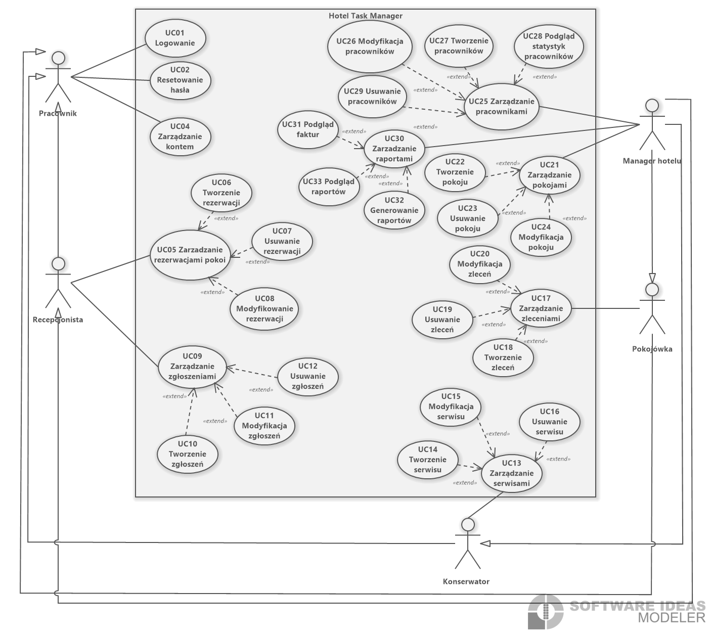
- ###### [Diagramy aktywności]
#### Logowanie

#### Tworzenie rezerwacji

#### Podgląd statystyk pracowników

#### Resetowanie hasła
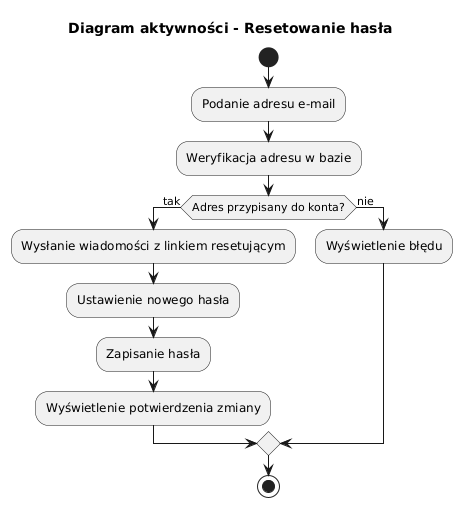
#### Usuwanie pracowników

#### Podgląd raportów
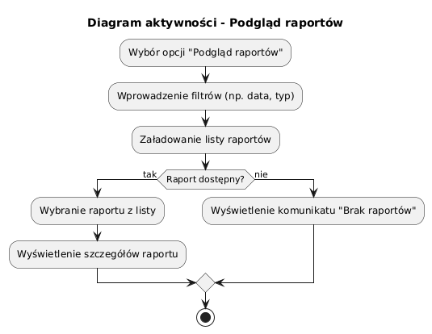
#### Modyfikacja rezerwacji

- ###### [Diagramy sekwencji]
#### Logowanie

### Dodawanie pracownika

### Dodawanie uwag do zadania

### Edytowanie pracownika

### Usuwanie zgłoszenia
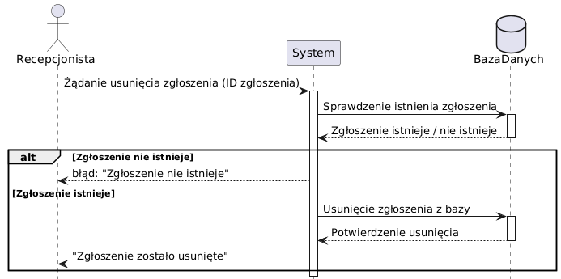
### Usuwanie pracownika

### Przeglądanie statystyk zespołu

- ###### [Diagram klas]


## Baza danych
###### Diagram ERD
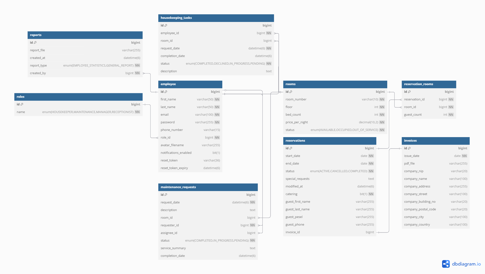

Kod Database Markup Language wykorzystany do stworzenia diagramu ERD bazy danych, znajduje się w pliku [schema/erd.dbml](schema/erd.dbml).

###### Tworzenie struktury bazy danych

Aplikacja wykorzystuje mechanizmy JPA oraz Hibernate do automatycznego tworzenia struktury bazy danych na podstawie modeli encji.

Aby poprawnie utworzyć strukturę bazy danych, należy wykonać następujące kroki:

1. Utworzyć pustą bazę danych o nazwie `hoteltaskmanager` (MariaDB).

2. Skonfigurować połączenie do bazy danych w pliku `application.properties`, podając odpowiednie dane dostępowe:

```
spring.application.name=hoteltaskmanager

spring.datasource.url=jdbc:mysql://localhost:3306/hoteltaskmanager?useSSL=false&serverTimezone=UTC
spring.datasource.username=root
spring.datasource.password=

spring.jpa.hibernate.ddl-auto=update
spring.jpa.show-sql=false
spring.jpa.properties.hibernate.dialect=org.hibernate.dialect.MariaDBDialect
```

3. Uruchomić aplikację.

Przy pierwszym uruchomieniu aplikacji mechanizm JPA automatycznie utworzy tabele w bazie danych na podstawie definicji encji w projekcie.

###### Seedowanie przykładowych danych

Aplikacja posiada wbudowany mechanizm seedowania danych testowych, który umożliwia szybkie wypełnienie bazy przykładowymi rekordami (takimi jak pracownicy, pokoje, rezerwacje).

Aby włączyć seedowanie:

1. Otworzyć plik `application.properties`.

2. Zmienić wartość właściwości `app.db.seed` na `true`:

```
app.db.seed=true
```

3. Uruchomić aplikację.

Podczas startu aplikacji seeder automatycznie wypełni bazę przykładowymi danymi.

4. (Opcjonalnie) Po zakończeniu procesu seedowania należy zmienić `app.db.seed` z powrotem na `false`, aby uniknąć ponownego seedowania przy kolejnych uruchomieniach:

```
app.db.seed=false
```

## Wykorzystane technologie
- **Java 22** – główny język backendu
- **Spring Boot** – framework do tworzenia REST API
- **MariaDB** – relacyjna baza danych
- **React + TypeScript** – interfejs użytkownika (frontend)
- **Vite** – szybkie środowisko budowania i dev-server dla React
- **Tabler UI** – gotowe komponenty i stylowanie interfejsu
- **Electron** – uruchomienie aplikacji jako natywny program desktopowy
- **Axios** – komunikacja między frontendem a backendem
- **ApexCharts** – wizualizacja danych na wykresach

## Pliki instalacyjne wraz z opisem instalacji i konfiguracji wraz pierwszego uruchomienia

### 1. Pobranie plików instalacyjnych

Aby zainstalować aplikację, należy:

1. Przejść do zakładki **[Releases](https://github.com/UR-INF/24-25-pz-inf-l3_g1_km/releases)**.
2. Pobrać plik **`hoteltaskmanager-installer.exe`** w najnowszej dostępnej wersji.
3. Uruchomić pobrany plik **z uprawnieniami administratora** (klikając prawym przyciskiem myszy i wybierając „Uruchom jako administrator”).

> **Uwaga:** W niektórych przypadkach system lub oprogramowanie antywirusowe może wyświetlić ostrzeżenie przy uruchamianiu pliku .exe. Należy potwierdzić, że chcemy kontynuować instalację.

### 2. Przebieg instalacji – krok po kroku

Po uruchomieniu instalatora zostanie wyświetlony interaktywny kreator. Oto kolejne etapy:

#### Krok 1: Wybór backendu

* Należy wybrać sposób działania backendu:

  * **Lokalny** – backend zostanie zainstalowany na tym komputerze.
  * **Zdalny** – aplikacja będzie łączyć się z zewnętrznym serwerem.

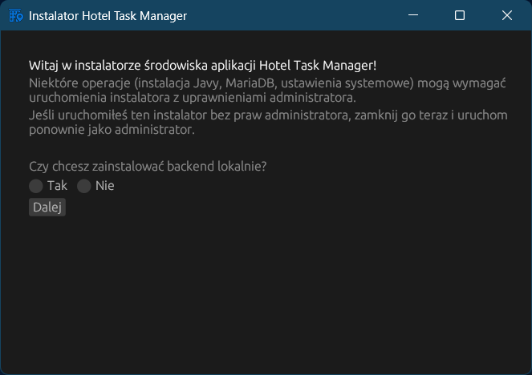

Po wybraniu opcji **zdalny backend**, instalator poprosi o podanie adresu i portu zewnętrznego serwera. Można wówczas sprawdzić połączenie, klikając przycisk **Sprawdź połączenie**.

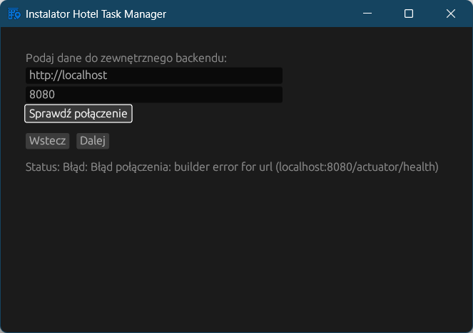

#### Krok 2: Konfiguracja bazy danych

W tym kroku należy zdecydować, czy aplikacja ma:

* **Utworzyć nową lokalną bazę danych** – instalator sam przygotuje strukturę i dane.
* **Połączyć się z istniejącą bazą danych** – użytkownik podaje dane logowania do istniejącej bazy.

Dodatkowo można zaznaczyć opcję automatycznego **utworzenia struktury bazy oraz wypełnienia przykładowymi danymi** przy pierwszym uruchomieniu.

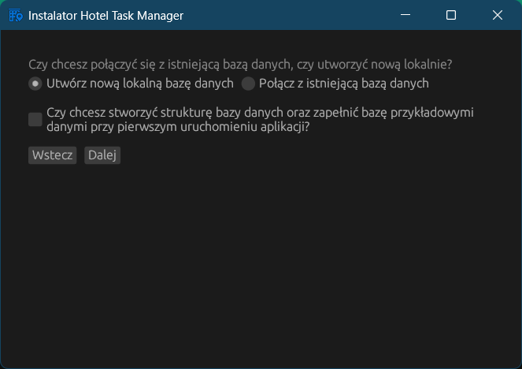

#### Krok 3: Konfiguracja lokalnej bazy danych

Instalator automatycznie sprawdza, czy MariaDB jest zainstalowana w systemie:

* **Jeśli MariaDB nie jest obecna**, instalator zainstaluje ją automatycznie.
* **Jeśli MariaDB jest już zainstalowana**, użytkownik zostanie poproszony o podanie danych do utworzenia bazy:

  * hasło administratora (`root`),
  * nazwę nowej bazy danych.

Po uzupełnieniu pól można utworzyć bazę, klikając **Utwórz bazę danych**.

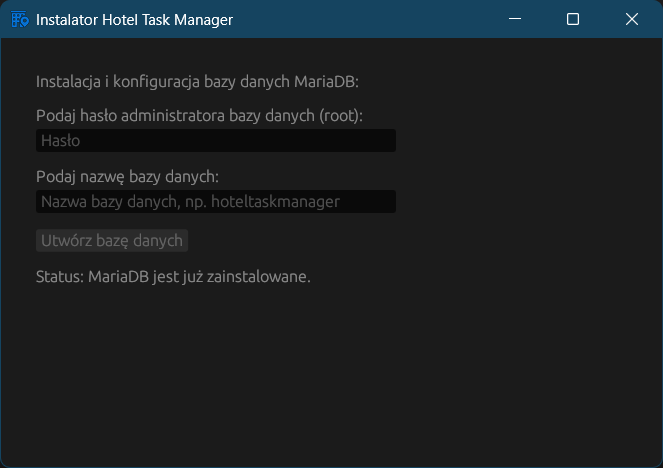

#### Krok 4: Weryfikacja środowiska Java

Na tym etapie instalator sprawdza, czy na systemie zainstalowane jest środowisko **Java 21 lub nowsze**:

* Jeśli odpowiednia Java **nie jest zainstalowana**, instalator zainstaluje ją automatycznie.
* Następnie podejmuje próbę ustawienia zmiennej środowiskowej `JAVA_HOME`.

> W przypadku uruchomienia instalatora **bez uprawnień administratora**, system może zablokować modyfikację rejestru — przez co nie uda się ustawić `JAVA_HOME`.

Przykład błędu związanego z brakiem uprawnień:
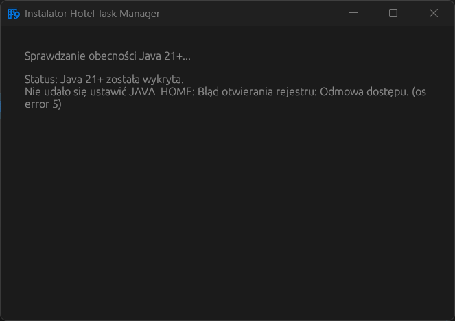

#### Krok 5: Instalacja backendu i integracja z frontendem

Na tym etapie instalator:

* **kopiuje pliki backendu** do domyślnej lokalizacji (`C:\Hotel Task Manager Environment\backend\backend.jar`),
* a następnie pyta użytkownika, czy frontend został już zainstalowany.

Użytkownik ma do wyboru:

* **„Nie – zainstaluj teraz”** – instalator przechodzi do instalacji frontendu,
* **„Frontend już zainstalowany – przejdź dalej”** – pomija ten krok.

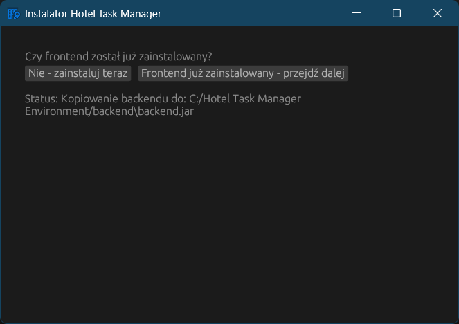

Jeśli użytkownik wybierze opcję **„Nie – zainstaluj teraz”**, zostanie automatycznie uruchomiony **osobny instalator frontendu**. Należy go **przejść do końca** (przeklikując klasyczny kreator), a następnie **wrócić do głównego instalatora** i kontynuować konfigurację.

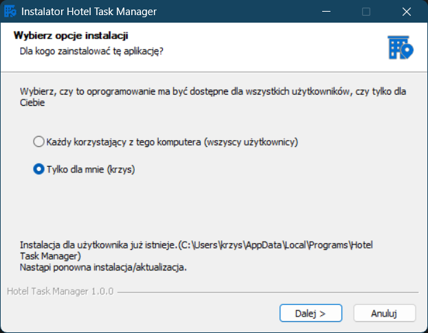

#### Krok 6: Zakończenie instalacji

Po poprawnym zakończeniu instalacji backendu i (opcjonalnie) frontendu, instalator wyświetli potwierdzenie zakończenia konfiguracji.
Frontend zostaje automatycznie zaktualizowany do współpracy z backendem.

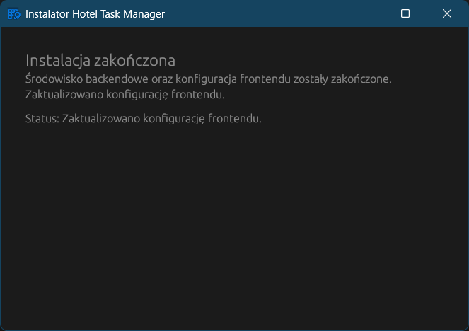


